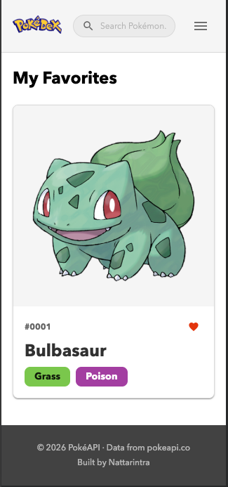
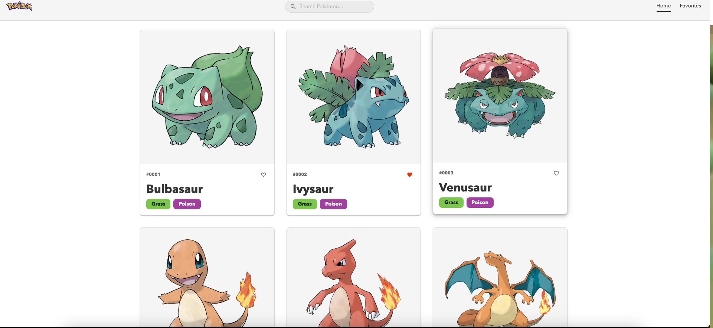
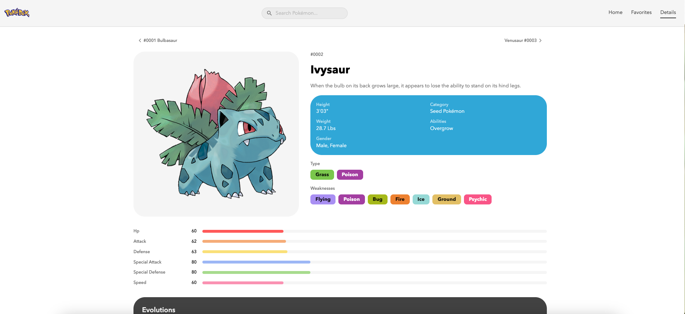
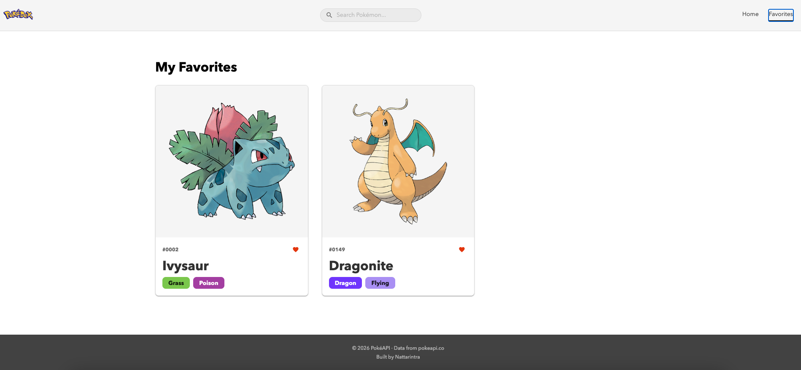
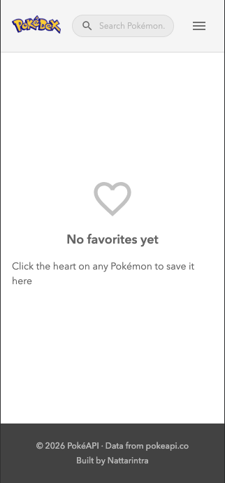
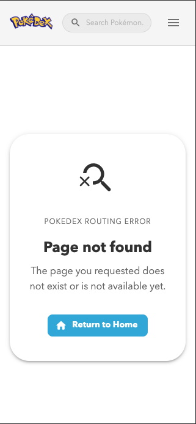
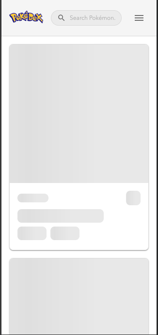

# Pokemon Project

## Project Overview

This project is a Pokemon web application built with React, TypeScript, and Vite. The main goal of the application is to allow users to explore Pokemon in a clean and interactive interface. Users can browse a list of Pokemon, search by name, filter by type, open a detailed page for each Pokemon, and save favorites for quick access later.

This project was created to practice building a modern frontend application that uses API data, client-side routing, reusable components, custom hooks, and responsive UI design.

## Project Purpose

The purpose of this project is to improve practical frontend development skills through a real application. It focuses on:

- Working with an external API
- Managing asynchronous data fetching
- Creating a responsive and user-friendly interface
- Structuring a React project in a scalable way
- Handling loading, error, and empty states properly
- Writing tests for components, hooks, and services

## Main Features

### 1. Pokemon List Page

The homepage displays a list of Pokemon cards. Each card shows key information such as the Pokemon's name, image, and type. This gives users a quick overview and acts as the main entry point of the app.

### 2. Search Functionality

Users can search for Pokemon by name. The search input is designed to feel responsive and includes debounced updates so filtering does not happen too aggressively while the user is typing.

### 3. Type Filtering

Users can filter Pokemon by type to narrow the displayed results. This makes it easier to explore Pokemon based on categories such as fire, water, grass, or electric.

### 4. Pagination

The homepage includes pagination so that the Pokemon list stays organized and easy to navigate. Instead of showing too many items at once, the app divides the list into manageable pages.

### 5. Pokemon Details Page

Each Pokemon has its own details page. When a user clicks a card, they are taken to a dedicated page where they can see more complete information about that Pokemon.

### 6. Detailed Pokemon Information

The details page includes:

- Pokemon identity information
- Description and category
- Height and weight
- Abilities
- Gender information
- Base stats
- Pokemon types
- Weaknesses
- Evolution chain

### 7. Favorites System

Users can mark Pokemon as favorites by clicking the heart button. Favorited Pokemon are saved locally and displayed on a separate favorites page, making the feature useful even without a backend.

### 8. Error Handling

The app includes user-friendly error handling. If an API request fails, the interface shows a clear error state and provides retry options. Partial failures are also handled gracefully in some cases.

### 9. Loading States

Skeleton loading components are used while data is being fetched. This improves the user experience by giving visual feedback instead of showing a blank screen.

## Screenshots

### Home Page



### Home Page Desktop View



### Pokemon Details Page



### Favorites Page



### Empty Favorites State



### Page Not Found



### Loading Skeleton State



## Technologies Used

This project uses the following technologies:

- React for building the UI
- TypeScript for type safety and more maintainable code
- Vite for fast development and build performance
- React Router for page navigation
- TanStack React Query for server-state management and caching
- Material UI for the component system and theming
- Jest and Testing Library for testing

## Project Structure

The project is organized into separate folders to keep the code clean and maintainable:

- `src/pages` contains page-level components such as Home, Details, Favorites, and Not Found
- `src/components` contains reusable UI components
- `src/hooks` contains custom hooks for reusable logic
- `src/api` contains API request functions and service logic
- `src/utils` contains helper utilities and formatters
- `src/errors` contains centralized error handling logic
- `src/theme` contains the app theme, tokens, and component styling overrides
- `src/types` contains TypeScript types and interfaces

## How the Application Works

When the user opens the app, the homepage loads a list of Pokemon from the API. The user can then search by name, filter by type, and switch between pages of results. Clicking a Pokemon card opens the details page, where the app fetches more detailed information such as stats, species data, weaknesses, and evolution chain information.

The app also allows users to save favorite Pokemon. These favorites are stored in `localStorage`, which means the data stays available in the browser even after refreshing the page.

## API Integration

The application uses Pokemon API data and transforms it into a format that is easier to display in the UI.

The API layer handles:

- Fetching the main Pokemon list
- Fetching summary data for each Pokemon card
- Fetching Pokemon details by ID
- Fetching species information
- Fetching evolution chain data
- Fetching type data for weakness calculations

One important part of the project is that some requests are handled in a fault-tolerant way. If some related requests fail, the app can still show available data and report how many requests failed instead of breaking completely.

## State Management and Logic

This project separates UI logic and data logic using custom hooks and React Query.

Important logic includes:

- `usePokemonListQuery` for fetching and caching the Pokemon list
- `usePokemonDetailQuery` for fetching and caching Pokemon detail data
- `useSearchFilter` for handling search, type filtering, pagination, and debounced input
- `useFavorites` for managing favorite Pokemon and saving them to `localStorage`
- `usePokemonNavigation` for moving between previous and next Pokemon on the details page

The app also uses URL search parameters for some filters, which helps keep the user interface state more shareable and easier to manage.

## Design and User Interface

The interface is designed to be simple, visual, and responsive. Material UI is used to create a consistent layout and styling system across the app.

Key UI choices include:

- Responsive card layout for different screen sizes
- Reusable card and layout components
- A modal-based search experience
- Skeleton states for loading feedback
- Error banners for failed requests
- Theme customization for a more polished visual identity

## Error Handling Strategy

Error handling is an important part of the project. The app includes separate logic for HTTP errors and network errors. This makes it easier to show clearer feedback to the user depending on what went wrong.

The application also includes:

- Retry support for failed queries
- Query boundaries for loading and error states
- User-friendly error messages
- Partial data rendering when some related requests fail

## Testing

This project uses Jest and Testing Library to automatically test important parts of the app. Testing helps improve reliability and makes it easier to refactor code with confidence.

The test coverage includes:

- Component tests
- Hook tests
- API and service tests
- Utility function tests
- Error handling tests

Testing is especially useful in this project because many features depend on asynchronous data, user interaction, and reusable logic.

## Challenges and Solutions

During development, several challenges appeared:

### Handling Multiple API Requests

The details page depends on more than one API request, including Pokemon details, species, type information, and evolution data. This was solved by separating API functions and formatting the returned data into a cleaner structure for the UI.

### Managing Search and Filters

Search and filtering needed to feel fast and intuitive. Debounced input and URL-based filters helped make the experience more stable and user-friendly.

### Preventing Poor Loading Experience

Instead of showing empty screens while waiting for data, skeleton components were added. This gives users immediate visual feedback.

### Saving Favorites Without a Backend

Favorites were implemented using `localStorage`, which made it possible to persist user choices without creating a database or authentication system.

### Handling Partial Failures

Some requests may fail while others succeed. Instead of blocking the whole page, the app allows partial data to be shown and reports failures in a controlled way.

## What I Learned

Through this project, I improved my skills in:

- React component architecture
- TypeScript typing
- Custom hooks
- API integration
- React Query caching and async state management
- Error handling strategies
- Testing frontend features
- Building a more polished user experience

This project also helped me understand how to organize a frontend codebase so it remains readable and scalable as features grow.

## Future Improvements

There are several ways this project could be improved in the future:

- Add more advanced filtering options
- Improve accessibility support
- Add animations and transitions
- Allow users to compare Pokemon
- Store favorites in a backend for cross-device access
- Expand test coverage further
- Optimize performance for larger datasets

## Conclusion

This Pokemon project is a practical frontend application that combines API integration, reusable React architecture, custom hooks, testing, and responsive design. It demonstrates both technical implementation and user experience considerations.

Overall, the project was valuable because it provided hands-on experience with real-world frontend development patterns and helped strengthen both coding and problem-solving skills.

## Setup Instructions

### Prerequisites

- Node.js
- npm

### Run the Project

```bash
npm install
npm run dev
```

### Build the Project

```bash
npm run build
```

### Run Tests

```bash
npm test
```
